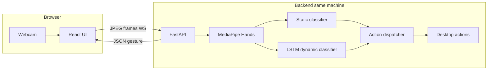

# AI Gesture Control

A touchless control system that uses your **webcam** to detect hand gestures and trigger desktop actions. A **React** frontend captures video and streams frames to a local **FastAPI** backend, which runs **MediaPipe** for hand landmarks, classifies **static** poses with rules and **dynamic** motions with an **LSTM**, then dispatches OS actions (volume, slides, scroll, etc.) via optional **PyAutoGUI**.

Designed for **local co-located deployment**: browser + backend on the **same machine** so actions control your desktop.

---

## Table of contents

- [Features](#features)
- [Architecture](#architecture)
- [Prerequisites](#prerequisites)
- [Installation](#installation)
- [Running the application](#running-the-application)
- [Supported gestures](#supported-gestures)
- [Collecting labeled training data (webcam)](#collecting-labeled-training-data-webcam)
- [Training and evaluating the LSTM](#training-and-evaluating-the-lstm)
- [API reference](#api-reference)
- [Configuration](#configuration)
- [Testing](#testing)
- [Troubleshooting](#troubleshooting)
- [Project structure](#project-structure)
- [Documentation](#documentation)

---

## Features

- Real-time hand landmark detection (21 points per hand, up to 2 hands in engine; UI uses primary hand)
- **6 static gestures** — rule-based, no training required
- **4 dynamic gestures** — LSTM on 30-frame landmark windows (train on your own data)
- Live camera feed with skeleton overlay and confidence display
- WebSocket streaming for low-latency inference
- Configurable gesture-to-action mappings (REST API + `mappings.json`)
- Webcam-based **labeled data collection** for model training and validation
- Automated tests (pytest) and evaluation scripts

---

## Architecture



**Data flow**

1. Browser captures webcam frames (~30 FPS).
2. Each frame is sent as a JPEG blob over WebSocket to `ws://localhost:8000/ws`.
3. Backend decodes the frame, runs MediaPipe, classifies the gesture.
4. JSON response includes `gesture`, `confidence`, `landmarks`, `action`, `timestamp`.
5. If confidence is sufficient and debounce allows, **PyAutoGUI** runs the mapped OS action.

---

## Prerequisites

| Requirement | Notes |
|-------------|--------|
| **Python** | 3.9+ (3.10+ recommended) |
| **Node.js** | 18+ for the frontend |
| **Webcam** | 720p or higher recommended |
| **OS** | macOS, Linux, or Windows (action keys differ slightly on macOS) |

Optional:

- **TensorFlow** — train/evaluate the dynamic LSTM (`requirements-ml.txt`)
- **PyAutoGUI** — trigger real desktop actions (`requirements-desktop.txt`; may fail to build on some macOS/Python setups)

---

## Installation

### 1. Clone the repository

```bash
git clone git@github.com:Lokeshwar15/Ai-gesture-control.git
cd Ai-gesture-control
```

### 2. Backend

```bash
cd backend
python3 -m venv .venv
source .venv/bin/activate          # Windows: .venv\Scripts\activate
pip install --upgrade pip
pip install -r requirements.txt
```

**Optional extras**

```bash
pip install -r requirements-desktop.txt   # PyAutoGUI for OS control
pip install -r requirements-ml.txt        # TensorFlow for LSTM train/infer
```

### 3. Frontend

```bash
cd frontend
npm install
```

---

## Running the application

Use **two terminals**.

**Terminal 1 — backend**

```bash
cd backend
source .venv/bin/activate
uvicorn app.main:app --reload --host 0.0.0.0 --port 8000
```

**Terminal 2 — frontend**

```bash
cd frontend
npm run dev
```

Open **http://localhost:5173**, allow camera access, and confirm **WebSocket: connected**.

| Service | URL |
|---------|-----|
| Frontend | http://localhost:5173 |
| Backend API | http://localhost:8000 |
| API docs (Swagger) | http://localhost:8000/docs |
| WebSocket | `ws://localhost:8000/ws` |

**Custom WebSocket URL** (frontend): create `frontend/.env`:

```env
VITE_WS_URL=ws://localhost:8000/ws
```

---

## Supported gestures

### Static (rule-based, work without a trained model)

| Gesture | How to perform | Default action |
|---------|----------------|----------------|
| Thumbs up | Thumb extended, other fingers curled | Volume up |
| Thumbs down | Thumb pointing down, fingers curled | Volume down |
| Open palm | All five fingers extended | Play / pause |
| Closed fist | All fingers curled | Mute toggle |
| Peace sign | Index + middle extended | Screenshot |
| Pinch | Thumb and index tips close together | Zoom in |

Static gestures use a **hold timer** (200–300 ms) before confirmation to reduce flicker.

### Dynamic (LSTM — requires `backend/ml/models/gesture_lstm.keras`)

| Gesture | How to perform | Default action |
|---------|----------------|----------------|
| Swipe left | Palm moves quickly left | Previous slide / track |
| Swipe right | Palm moves quickly right | Next slide / track |
| Swipe up | Palm moves quickly up | Scroll up |
| Wave | Repeated wrist side-to-side motion | Play / pause |

Until you train and place `gesture_lstm.keras` in `backend/ml/models/`, dynamic gestures return `UNKNOWN`.

### Confidence and debounce

- Gestures below **75%** confidence are reported as `UNKNOWN`.
- The same gesture will not fire an action more than once every **500 ms**.

---

## Collecting labeled training data (webcam)

You can build a labeled dataset **from your own webcam**. MediaPipe extracts landmarks; you assign labels with the keyboard. Files are saved under `backend/ml/data/raw/` as `.npz` archives (landmarks only — no video stored).

### Dynamic mode (LSTM training clips)

Record **2–3 second motion clips** for swipes and wave:

```bash
cd backend
source .venv/bin/activate
python ml/scripts/collect_landmarks.py
```

| Key | Label |
|-----|--------|
| `0` | `none` — idle hand, small movements, near-miss poses |
| `1` | `swipe_left` |
| `2` | `swipe_right` |
| `3` | `swipe_up` |
| `4` | `wave` |
| `SPACE` | Start / stop recording |
| `q` | Quit |

**Steps**

1. Press `0`–`4` to select the label shown on screen.
2. Press `SPACE` to start recording.
3. Perform the gesture for 2–3 seconds (keep hand in frame).
4. Press `SPACE` again to save → `ml/data/raw/{label}_{timestamp}.npz`.

**Recommended volume:** at least **150 clips per dynamic class**, with varied speed, distance, lighting, and left/right hand.

### Static mode (validation / rule tuning)

Save **one labeled still frame** per keypress:

```bash
python ml/scripts/collect_landmarks.py --mode static
```

| Key | Label |
|-----|--------|
| `0` | `thumbs_up` |
| `1` | `thumbs_down` |
| `2` | `open_palm` |
| `3` | `closed_fist` |
| `4` | `peace_sign` |
| `5` | `pinch` |
| `q` | Quit |

Hold the pose, then press the number when your hand is detected.

**Recommended volume:** **50–100 frames per static gesture** for a solid validation set.

### Collector options

```bash
python ml/scripts/collect_landmarks.py --help

  --mode {dynamic,static}   Collection mode (default: dynamic)
  --out PATH                Output directory (default: ml/data/raw)
  --camera 0                Camera device index
  --width 1280 --height 720 Resolution
```

### NPZ file format

Each file contains:

| Key | Shape / type | Description |
|-----|----------------|-------------|
| `landmarks` | `(T, 21, 3)` float32 | Normalized MediaPipe hand landmarks |
| `label` | string | Gesture class name |

---

## Training and evaluating the LSTM

### Full pipeline (real webcam data)

```bash
cd backend
source .venv/bin/activate

# 1. Collect clips (see above)
python ml/scripts/collect_landmarks.py

# 2. Build windowed dataset (30 frames, 70/15/15 split)
python ml/scripts/build_dataset.py

# 3. Train model
pip install -r requirements-ml.txt
python ml/scripts/train_lstm.py

# 4. Evaluate (writes ml/models/metrics.json)
python ml/scripts/evaluate_model.py --split test --min-accuracy 0.88
```

### Bootstrap with synthetic data (development only)

```bash
python ml/scripts/generate_synthetic_raw.py
python ml/scripts/build_dataset.py
python ml/scripts/train_lstm.py --synthetic   # if splits missing, creates random data
```

### Static validation from webcam captures

```bash
python ml/scripts/build_static_val_from_raw.py
python ml/scripts/evaluate_model.py --no-gate
```

### Benchmark inference latency

```bash
python ml/scripts/benchmark_latency.py
# Output: ml/models/benchmark.json (p50/p95 ms)
```

### ML script reference

| Script | Purpose |
|--------|---------|
| `ml/scripts/collect_landmarks.py` | Webcam labeled capture (dynamic or static) |
| `ml/scripts/generate_synthetic_raw.py` | Generate synthetic raw clips for dev |
| `ml/scripts/build_dataset.py` | Sliding windows, normalization, train/val/test splits |
| `ml/scripts/train_lstm.py` | Train LSTM → `ml/models/gesture_lstm.keras` |
| `ml/scripts/evaluate_model.py` | Accuracy, confusion matrix, metrics JSON |
| `ml/scripts/build_static_val_from_raw.py` | Merge static raw files → `static_val.npz` |
| `ml/scripts/build_static_synthetic_val.py` | Synthetic static validation set for CI |
| `ml/scripts/benchmark_latency.py` | Backend inference timing |

**Outputs**

| Path | Description |
|------|-------------|
| `ml/data/raw/` | Raw labeled clips from webcam |
| `ml/data/splits/` | `train.npz`, `val.npz`, `test.npz` |
| `ml/models/gesture_lstm.keras` | Trained dynamic gesture model |
| `ml/models/label_map.json` | Class index → label names |
| `ml/models/metrics.json` | Last evaluation run |

---

## API reference

### REST

| Method | Endpoint | Description |
|--------|----------|-------------|
| `GET` | `/health` | Status and whether LSTM weights are loaded |
| `GET` | `/gestures` | List of supported gestures and default actions |
| `GET` | `/mappings` | Current gesture → action mapping |
| `POST` | `/mappings` | Update mapping (`{"gesture": "...", "action": "..."}`) |
| `GET` | `/history` | Recent detected gestures (`?limit=50`) |
| `POST` | `/session/start` | Start session (returns `session_id`) |
| `POST` | `/session/stop` | Clear sessions |

### WebSocket

**URL:** `ws://localhost:8000/ws`

- **Client → server:** binary JPEG frame
- **Server → client:** JSON

```json
{
  "gesture": "open_palm",
  "confidence": 0.92,
  "landmarks": [{ "handedness": "Right", "landmarks": [{ "x": 0.5, "y": 0.6, "z": -0.01 }] }],
  "action": "play_pause",
  "timestamp": 1715760000.123
}
```

Connections idle for **30 seconds** are closed. Up to **50** concurrent WebSocket sessions are supported.

---

## Configuration

### Gesture mappings

Mappings are stored in `backend/mappings.json` (created when you `POST /mappings`). Defaults are defined in `app/gesture_engine/action_dispatcher.py`.

Example:

```bash
curl -X POST http://localhost:8000/mappings \
  -H "Content-Type: application/json" \
  -d '{"gesture": "open_palm", "action": "scroll_up"}'
```

### Action names (for mappings)

`volume_up`, `volume_down`, `play_pause`, `mute_toggle`, `screenshot`, `zoom_in`, `zoom_out`, `previous`, `next`, `scroll_up`

---

## Testing

```bash
cd backend
source .venv/bin/activate
pip install -r requirements.txt

# Synthetic static validation set (for unit/eval tests)
python ml/scripts/build_static_synthetic_val.py

# Run test suite
python -m pytest tests/ -v
```

**Manual end-to-end checklist:** [docs/E2E_VALIDATION_CHECKLIST.md](docs/E2E_VALIDATION_CHECKLIST.md)

---

## Troubleshooting

| Issue | What to try |
|-------|-------------|
| WebSocket **disconnected** | Ensure backend is running on port 8000; check `VITE_WS_URL` |
| Camera permission denied | Use HTTPS or `localhost`; check browser site settings |
| All gestures **UNKNOWN** | Improve lighting; center hand in frame; lower fast movement |
| Dynamic gestures never detected | Train LSTM and confirm `/health` shows `lstm_loaded: true` |
| **PyAutoGUI** install fails (macOS) | Use core `requirements.txt` only; gestures still classify without OS actions |
| **TensorFlow** install fails | Use Python 3.10–3.11 in a fresh venv; or run static gestures only |
| High latency | Reduce resolution in collector/app; process every 2nd frame (future setting) |
| `collect_landmarks` window not opening | Install OpenCV GUI support; on headless servers use a machine with a display |

---

## Project structure

```
.
├── README.md
├── docs/
│   ├── E2E_VALIDATION_CHECKLIST.md
│   └── files (1)/                    # BRD, FRD, implementation plan
├── backend/
│   ├── app/
│   │   ├── main.py                   # FastAPI + WebSocket
│   │   ├── gesture_engine/
│   │   │   ├── mediapipe_processor.py
│   │   │   ├── finger_state.py
│   │   │   ├── static_classifier.py
│   │   │   ├── dynamic_classifier.py
│   │   │   ├── classifier.py
│   │   │   └── action_dispatcher.py
│   │   └── schemas/
│   ├── ml/
│   │   ├── data/raw|processed|splits/
│   │   ├── models/
│   │   └── scripts/                  # collect, train, evaluate
│   ├── tests/
│   ├── requirements.txt
│   ├── requirements-ml.txt
│   └── requirements-desktop.txt
└── frontend/
    ├── src/
    │   ├── components/               # CameraFeed, GestureOverlay
    │   └── hooks/                    # useCamera, useWebSocket
    └── package.json
```

---

## Documentation

| Document | Description |
|----------|-------------|
| [docs/files (1)/BRD_Gesture_Control_System.md](docs/files%20(1)/BRD_Gesture_Control_System.md) | Business requirements |
| [docs/files (1)/FRD_Gesture_Control_System.md](docs/files%20(1)/FRD_Gesture_Control_System.md) | Functional / technical spec |
| [docs/files (1)/Implementation_Plan_Gesture_Control_System.md](docs/files%20(1)/Implementation_Plan_Gesture_Control_System.md) | 12-week implementation plan |
| [docs/E2E_VALIDATION_CHECKLIST.md](docs/E2E_VALIDATION_CHECKLIST.md) | Manual QA steps |

---

## License

This project is part of an AI/ML capstone. See repository owner for license terms.
